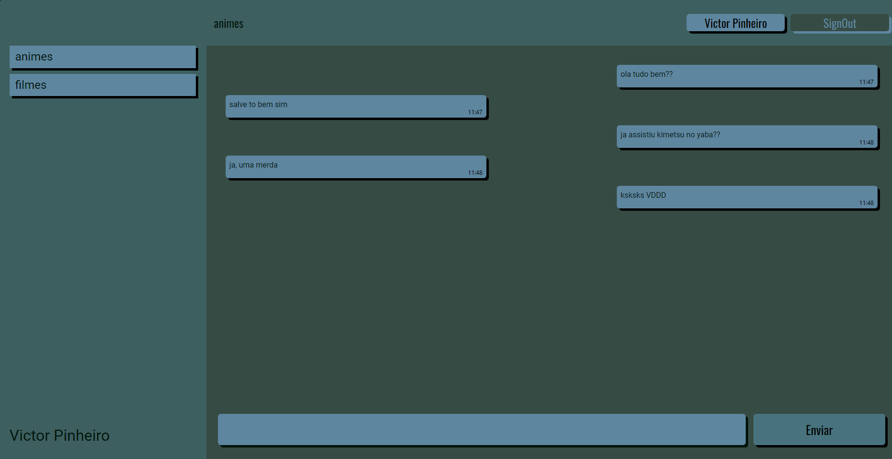

# Web-based Messaging Application on real time
### Project Overview
This project is a simple yet efficient online chat platform allowing real-time interaction across chat rooms. At its core, users can engage in conversations within different chat environments. For its implementation, I utilized Firebase and React technologies. Firebase was chosen primarily for its cloud-based capabilities so i could learn the sintaxe, while i could learn more deep React and implementing modern web development concepts.   
Throughout the development process, I extensively referred to Firebase documentation to grasp its functionalities. Additionally, I delved into React hooks, mainly useEffect, useState, and useRef to manage the application state and lifecycle effectively. ChatGPT played a pivotal role during moments of uncertainty, serving as a valuable resource for clarifying concepts and overcoming challenges.

### Simplified Interface
Given the straightforward nature of the application, the interface is intentionally kept simple, because this is just a test. On the left side of the site, users can navigate through different chat rooms, while the main chat is where you interact and send messages.

### React Implementation
In keeping with the project's simplicity, I opted for a straightforward React setup without incorporating React-Router-Dom for the rooms navigation. The application relies heavily on React hooks such as useEffect, useState, and useRef. While this approach may raise concerns regarding optimization, it aligns with the project's educational focus, emphasizing learning and understanding fundamental React concepts.

### Pending Tasks
Two critical aspects remain to be addressed in the project:

1. Security Rules: Implementing robust security rules within Firebase to safeguard user data and ensure a secure environment for communication.
2. Optimization: Addressing potential performance issues and optimizing the application for enhanced user experience.

### Screenshots

I hope you find this project insightful and enjoyable. Your feedback is always appreciated!